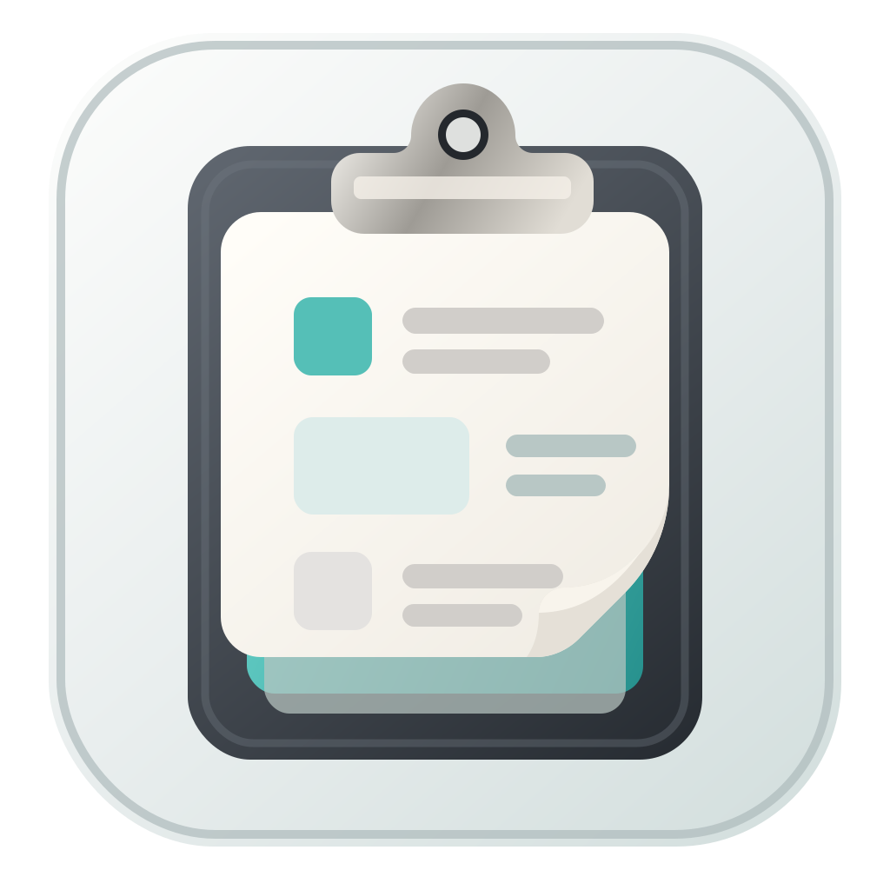

<p align="center">
  
</p>

<h1 align="center">MacShelf</h1>

<p align="center">
  A lightweight macOS clipboard manager for text and images.
</p>

<p align="center">
  <strong>Menu bar access.</strong>
  <strong>Searchable history.</strong>
  <strong>Quick paste actions.</strong>
</p>

## Overview

MacShelf keeps clipboard history in the menu bar, lets you search previous
items, previews text and images, and pastes directly into the active app.

## Features

- Text and image clipboard history
- Menu bar popover with global hotkey support
- Search and keyboard navigation
- Quick paste with Return or number shortcuts
- Image previews and compact history rows
- Pin, unpin, delete, and clear entries
- Duplicate suppression and self-write protection
- Privacy filters for transient pasteboard items

## Requirements

- macOS 14 or newer

If Accessibility permission is not granted, MacShelf still copies the selected
item to the clipboard, but it cannot trigger the paste shortcut automatically.

## Build

This repository vendors
[`KeyboardShortcuts`](https://github.com/sindresorhus/KeyboardShortcuts) under
`Vendor/KeyboardShortcuts`, so the app can be built without downloading SwiftPM
dependencies.

### Build a launchable app bundle

```bash
scripts/build.sh
```

The script compiles the Swift package, creates `build/MacShelf.app`, copies the
required app resources, and ad-hoc signs the bundle.

To relaunch after building:

```bash
scripts/build.sh --run
```

### Create a DMG

```bash
scripts/package-dmg.sh
```

The DMG is written to `dist/MacShelf-<version>.dmg` and includes an
`/Applications` shortcut for drag-and-drop installation.

### Open in Xcode

```bash
open Package.swift
```

Select the `MacShelf` scheme and run on "My Mac".

### About `swift run`

`swift run MacShelf` launches a bare executable, not a proper `.app` bundle.
For normal use, prefer `scripts/build.sh` or Xcode.

## Usage

1. Launch `build/MacShelf.app`.
2. Open the popover from the menu bar or with `Cmd+Shift+V`.
3. Search for a previous item or move through the list with the keyboard.
4. Press Return, click an item, or use `Cmd+1` to `Cmd+9` to paste it.
5. Hold Space to preview the hovered item.

Settings are available from the footer menu. From there you can change the
history limit, record a different hotkey, check Accessibility status, and open
System Settings.

## Privacy

MacShelf skips pasteboard entries marked with:

- `org.nspasteboard.ConcealedType`
- `org.nspasteboard.TransientType`
- `org.nspasteboard.AutoGeneratedType`

It also ignores a built-in list of known password-manager bundle IDs.

When MacShelf writes one of its own history items back to the clipboard, it
marks the write as auto-generated so the same item is not captured again.

## How It Works

`ClipboardMonitor` polls `NSPasteboard.general.changeCount` every 500 ms.

Text items are stored as exact strings in SwiftData. Image items are decoded
from common pasteboard types, file URLs, and AppKit payloads, then stored as PNG
data with dimensions and a SHA-256 hash.

Duplicate handling is strict:

- Same text: ignored
- Same image hash: ignored
- MacShelf's own pasteboard writes: ignored

Pasting writes the selected item back to `NSPasteboard.general`. If Accessibility
permission is granted, MacShelf also posts a synthetic `Cmd+V` with `CGEvent`.

## Project Layout

```text
Sources/MacShelf
  App/
    MacShelfApp.swift        SwiftUI app entry and Settings scene
    AppDelegate.swift        Status item, popover, hotkey, monitor lifecycle
  Models/
    ClipboardItem.swift      SwiftData model for text and image entries
  Services/
    ClipboardMonitor.swift   Pasteboard polling, decoding, dedupe, pruning
    PasteService.swift       Pasteboard write and optional Cmd+V event
    PermissionsService.swift Accessibility status and settings shortcut
    HotkeyManager.swift      KeyboardShortcuts registration
  Views/
    MenuView.swift           Search, history list, key capture, preview state
    ItemRow.swift            A single clipboard history row
    DetailsCard.swift        Space preview card
    SettingsView.swift       General, Shortcuts, Privacy tabs
  Resources/
    Info.plist
    MacShelf.entitlements
    Assets.xcassets
```

## Notes

- MacShelf is a menu bar app and does not show a Dock icon.
- `build/MacShelf.app` is ad-hoc signed by the local build script.
- `dist/MacShelf-<version>.dmg` is suitable for GitHub Releases.
- Distribution builds should be signed and notarized with your Apple Developer ID.
